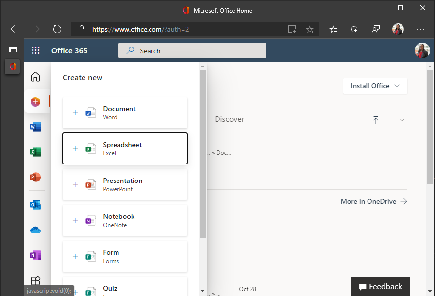

<!-- markdownlint-disable MD002 MD041 -->

<span data-ttu-id="f63ba-101">В этом упражнении вы создадим решение надстройки Office с помощью [Express.](http://expressjs.com/)</span><span class="sxs-lookup"><span data-stu-id="f63ba-101">In this exercise you will create an Office Add-in solution using [Express](http://expressjs.com/).</span></span> <span data-ttu-id="f63ba-102">Решение состоит из двух частей.</span><span class="sxs-lookup"><span data-stu-id="f63ba-102">The solution will consist of two parts.</span></span>

- <span data-ttu-id="f63ba-103">Надстройка, реализованная в качестве статических ФАЙЛОВ HTML и JavaScript.</span><span class="sxs-lookup"><span data-stu-id="f63ba-103">The add-in, implemented as static HTML and JavaScript files.</span></span>
- <span data-ttu-id="f63ba-104">Сервер Node.js/Express, обслуживающий надстройки и реализующий веб-API для получения данных для надстройки.</span><span class="sxs-lookup"><span data-stu-id="f63ba-104">A Node.js/Express server that serves the add-in and implements a web API to retrieve data for the add-in.</span></span>

## <a name="create-the-server"></a><span data-ttu-id="f63ba-105">Создание сервера</span><span class="sxs-lookup"><span data-stu-id="f63ba-105">Create the server</span></span>

1. <span data-ttu-id="f63ba-106">Откройте интерфейс командной строки (CLI), перейдите в каталог, в котором необходимо создать проект, и запустите следующую команду для создания package.jsфайла.</span><span class="sxs-lookup"><span data-stu-id="f63ba-106">Open your command-line interface (CLI), navigate to a directory where you want to create your project, and run the following command to generate a package.json file.</span></span>

    ```Shell
    yarn init
    ```

    <span data-ttu-id="f63ba-107">Введите значения для подсказок по мере необходимости.</span><span class="sxs-lookup"><span data-stu-id="f63ba-107">Enter values for the prompts as appropriate.</span></span> <span data-ttu-id="f63ba-108">Если вы не уверены, значения по умолчанию в порядке.</span><span class="sxs-lookup"><span data-stu-id="f63ba-108">If you're unsure, the default values are fine.</span></span>

1. <span data-ttu-id="f63ba-109">Запустите следующие команды для установки зависимостей.</span><span class="sxs-lookup"><span data-stu-id="f63ba-109">Run the following commands to install dependencies.</span></span>

    ```Shell
    yarn add express@4.17.1 express-promise-router@4.1.0 dotenv@8.2.0 node-fetch@2.6.1 jsonwebtoken@8.5.1@
    yarn add jwks-rsa@2.0.2 @azure/msal-node@1.0.2 @microsoft/microsoft-graph-client@2.2.1
    yarn add date-fns@2.21.1 date-fns-tz@1.1.4 isomorphic-fetch@3.0.0 windows-iana@5.0.1
    yarn add -D typescript@4.2.4 ts-node@9.1.1 nodemon@2.0.7 @types/node@14.14.41 @types/express@4.17.11
    yarn add -D @types/node-fetch@2.5.10 @types/jsonwebtoken@8.5.1 @types/microsoft-graph@1.35.0
    yarn add -D @types/office-js@1.0.174 @types/jquery@3.5.5 @types/isomorphic-fetch@0.0.35
    ```

1. <span data-ttu-id="f63ba-110">Запустите следующую команду, чтобы создать tsconfig.jsфайл.</span><span class="sxs-lookup"><span data-stu-id="f63ba-110">Run the following command to generate a tsconfig.json file.</span></span>

    ```Shell
    tsc --init
    ```

1. <span data-ttu-id="f63ba-111">Откройте **./tsconfig.jsв** текстовом редакторе и внести следующие изменения.</span><span class="sxs-lookup"><span data-stu-id="f63ba-111">Open **./tsconfig.json** in a text editor and make the following changes.</span></span>

    - <span data-ttu-id="f63ba-112">Измените `target` значение `es6` на .</span><span class="sxs-lookup"><span data-stu-id="f63ba-112">Change the `target` value to `es6`.</span></span>
    - <span data-ttu-id="f63ba-113">Отоносит `outDir` значение и установите `./dist` его.</span><span class="sxs-lookup"><span data-stu-id="f63ba-113">Uncomment the `outDir` value and set it to `./dist`.</span></span>
    - <span data-ttu-id="f63ba-114">Отоносит `rootDir` значение и установите `./src` его.</span><span class="sxs-lookup"><span data-stu-id="f63ba-114">Uncomment the `rootDir` value and set it to `./src`.</span></span>

1. <span data-ttu-id="f63ba-115">Откройте **./package.jsи** добавьте следующее свойство в JSON.</span><span class="sxs-lookup"><span data-stu-id="f63ba-115">Open **./package.json** and add the following property to the JSON.</span></span>

    ```json
    "scripts": {
      "start": "nodemon ./src/server.ts",
      "build": "tsc --project ./"
    },
    ```

1. <span data-ttu-id="f63ba-116">Запустите следующую команду для создания и установки сертификатов разработки для надстройки.</span><span class="sxs-lookup"><span data-stu-id="f63ba-116">Run the following command to generate and install development certificates for your add-in.</span></span>

    ```Shell
    npx office-addin-dev-certs install
    ```

    <span data-ttu-id="f63ba-117">Если вам будет предложено подтверждение, подтвердим действия.</span><span class="sxs-lookup"><span data-stu-id="f63ba-117">If prompted for confirmation, confirm the actions.</span></span> <span data-ttu-id="f63ba-118">После завершения команды вы увидите выход, аналогичный следующему.</span><span class="sxs-lookup"><span data-stu-id="f63ba-118">Once the command completes, you will see output similar to the following.</span></span>

    ```Shell
    You now have trusted access to https://localhost.
    Certificate: <path>\localhost.crt
    Key: <path>\localhost.key
    ```

1. <span data-ttu-id="f63ba-119">Создайте новый файл **с именем .env** в корне проекта и добавьте следующий код.</span><span class="sxs-lookup"><span data-stu-id="f63ba-119">Create a new file named **.env** in the root of your project and add the following code.</span></span>

    :::code language="ini" source="../demo/graph-tutorial/example.env":::

    <span data-ttu-id="f63ba-120">Замените путь к localhost.crt и путь к `PATH_TO_LOCALHOST.CRT` `PATH_TO_LOCALHOST.KEY` выходу localhost.key предыдущей командой.</span><span class="sxs-lookup"><span data-stu-id="f63ba-120">Replace `PATH_TO_LOCALHOST.CRT` with the path to localhost.crt and `PATH_TO_LOCALHOST.KEY` with the path to localhost.key output by the previous command.</span></span>

1. <span data-ttu-id="f63ba-121">Создайте новый каталог в корне проекта с именем **src**.</span><span class="sxs-lookup"><span data-stu-id="f63ba-121">Create a new directory in the root of your project named **src**.</span></span>

1. <span data-ttu-id="f63ba-122">Создайте два каталога **в каталоге ./src:** **addin** и **api.**</span><span class="sxs-lookup"><span data-stu-id="f63ba-122">Create two directories in the **./src** directory: **addin** and **api**.</span></span>

1. <span data-ttu-id="f63ba-123">Создайте новый файл с именем **auth.ts** в **каталоге ./src/api** и добавьте следующий код.</span><span class="sxs-lookup"><span data-stu-id="f63ba-123">Create a new file named **auth.ts** in the **./src/api** directory and add the following code.</span></span>

    ```typescript
    import Router from 'express-promise-router';

    const authRouter = Router();

    // TODO: Implement this router

    export default authRouter;
    ```

1. <span data-ttu-id="f63ba-124">Создайте новый файл с именем **graph.ts** в **каталоге ./src/api** и добавьте следующий код.</span><span class="sxs-lookup"><span data-stu-id="f63ba-124">Create a new file named **graph.ts** in the **./src/api** directory and add the following code.</span></span>

    ```typescript
    import Router from 'express-promise-router';

    const graphRouter = Router();

    // TODO: Implement this router

    export default graphRouter;
    ```

1. <span data-ttu-id="f63ba-125">Создайте новый файл **с именем server.ts** в **каталоге ./src** и добавьте следующий код.</span><span class="sxs-lookup"><span data-stu-id="f63ba-125">Create a new file named **server.ts** in the **./src** directory and add the following code.</span></span>

    :::code language="typescript" source="../demo/graph-tutorial/src/server.ts" id="ServerSnippet":::

## <a name="create-the-add-in"></a><span data-ttu-id="f63ba-126">Создание надстройки</span><span class="sxs-lookup"><span data-stu-id="f63ba-126">Create the add-in</span></span>

1. <span data-ttu-id="f63ba-127">Создайте новый файл **сtaskpane.html в** **каталоге ./src/addin** и добавьте следующий код.</span><span class="sxs-lookup"><span data-stu-id="f63ba-127">Create a new file named **taskpane.html** in the **./src/addin** directory and add the following code.</span></span>

    :::code language="html" source="../demo/graph-tutorial/src/addin/taskpane.html" id="TaskPaneHtmlSnippet":::

1. <span data-ttu-id="f63ba-128">Создайте новый файл **с именем taskpane.css** в **каталоге ./src/addin** и добавьте следующий код.</span><span class="sxs-lookup"><span data-stu-id="f63ba-128">Create a new file named **taskpane.css** in the **./src/addin** directory and add the following code.</span></span>

    :::code language="css" source="../demo/graph-tutorial/src/addin/taskpane.css":::

1. <span data-ttu-id="f63ba-129">Создайте новый файл **сtaskpane.js** в **каталоге ./src/addin** и добавьте следующий код.</span><span class="sxs-lookup"><span data-stu-id="f63ba-129">Create a new file named **taskpane.js** in the **./src/addin** directory and add the following code.</span></span>

    ```javascript
    // TEMPORARY CODE TO VERIFY ADD-IN LOADS
    'use strict';

    Office.onReady(info => {
      if (info.host === Office.HostType.Excel) {
        $(function() {
          $('p').text('Hello World!!');
        });
      }
    });
    ```

1. <span data-ttu-id="f63ba-130">Создание нового каталога в **каталоге src/addin** с именем **активов.**</span><span class="sxs-lookup"><span data-stu-id="f63ba-130">Create a new directory in the **.src/addin** directory named **assets**.</span></span>

1. <span data-ttu-id="f63ba-131">Добавьте три PNG-файла в этом каталоге в соответствии со следующей таблицей.</span><span class="sxs-lookup"><span data-stu-id="f63ba-131">Add three PNG files in this directory according to the following table.</span></span>

    | <span data-ttu-id="f63ba-132">Имя файла</span><span class="sxs-lookup"><span data-stu-id="f63ba-132">File name</span></span>   | <span data-ttu-id="f63ba-133">Размер пикселей</span><span class="sxs-lookup"><span data-stu-id="f63ba-133">Size in pixels</span></span> |
    |-------------|----------------|
    | <span data-ttu-id="f63ba-134">icon-80.png</span><span class="sxs-lookup"><span data-stu-id="f63ba-134">icon-80.png</span></span> | <span data-ttu-id="f63ba-135">80x80</span><span class="sxs-lookup"><span data-stu-id="f63ba-135">80x80</span></span>          |
    | <span data-ttu-id="f63ba-136">icon-32.png</span><span class="sxs-lookup"><span data-stu-id="f63ba-136">icon-32.png</span></span> | <span data-ttu-id="f63ba-137">32x32</span><span class="sxs-lookup"><span data-stu-id="f63ba-137">32x32</span></span>          |
    | <span data-ttu-id="f63ba-138">icon-16.png</span><span class="sxs-lookup"><span data-stu-id="f63ba-138">icon-16.png</span></span> | <span data-ttu-id="f63ba-139">16 x 16</span><span class="sxs-lookup"><span data-stu-id="f63ba-139">16x16</span></span>          |

    > [!NOTE]
    > <span data-ttu-id="f63ba-140">Вы можете использовать любое изображение, которое необходимо для этого шага.</span><span class="sxs-lookup"><span data-stu-id="f63ba-140">You can use any image you want for this step.</span></span> <span data-ttu-id="f63ba-141">Вы также можете скачать изображения, используемые в этом примере непосредственно [из GitHub](https://github.com/microsoftgraph/msgraph-training-office-addin/demo/graph-tutorial/src/addin/assets).</span><span class="sxs-lookup"><span data-stu-id="f63ba-141">You can also download the images used in this sample directly from [GitHub](https://github.com/microsoftgraph/msgraph-training-office-addin/demo/graph-tutorial/src/addin/assets).</span></span>

1. <span data-ttu-id="f63ba-142">Создание нового каталога в корне манифеста с именем **проекта**.</span><span class="sxs-lookup"><span data-stu-id="f63ba-142">Create a new directory in the root of the project named **manifest**.</span></span>

1. <span data-ttu-id="f63ba-143">Создайте новый файл **с именемmanifest.xml** в **папке ./manifest** и добавьте следующий код.</span><span class="sxs-lookup"><span data-stu-id="f63ba-143">Create a new file named **manifest.xml** in the **./manifest** folder and add the following code.</span></span> <span data-ttu-id="f63ba-144">Замените `NEW_GUID_HERE` новым GUID, например `b4fa03b8-1eb6-4e8b-a380-e0476be9e019` .</span><span class="sxs-lookup"><span data-stu-id="f63ba-144">Replace `NEW_GUID_HERE` with a new GUID, like `b4fa03b8-1eb6-4e8b-a380-e0476be9e019`.</span></span>

    :::code language="xml" source="../demo/graph-tutorial/manifest/manifest.xml":::

## <a name="side-load-the-add-in-in-excel"></a><span data-ttu-id="f63ba-145">Боковая загрузка надстройки в Excel</span><span class="sxs-lookup"><span data-stu-id="f63ba-145">Side-load the add-in in Excel</span></span>

1. <span data-ttu-id="f63ba-146">Запустите сервер с помощью следующей команды.</span><span class="sxs-lookup"><span data-stu-id="f63ba-146">Start the server by running the following command.</span></span>

    ```Shell
    yarn start
    ```

1. <span data-ttu-id="f63ba-147">Откройте браузер и просмотрите `https://localhost:3000/taskpane.html` .</span><span class="sxs-lookup"><span data-stu-id="f63ba-147">Open your browser and browse to `https://localhost:3000/taskpane.html`.</span></span> <span data-ttu-id="f63ba-148">Вы должны увидеть `Not loaded` сообщение.</span><span class="sxs-lookup"><span data-stu-id="f63ba-148">You should see a `Not loaded` message.</span></span>

1. <span data-ttu-id="f63ba-149">В браузере перейдите [в Office.com](https://www.office.com/) и войдите.</span><span class="sxs-lookup"><span data-stu-id="f63ba-149">In your browser, go to [Office.com](https://www.office.com/) and sign in.</span></span> <span data-ttu-id="f63ba-150">Выберите **Создать** в панели инструментов левой руки, а затем выберите **таблицу**.</span><span class="sxs-lookup"><span data-stu-id="f63ba-150">Select **Create** in the left-hand toolbar, then select **Spreadsheet**.</span></span>

    

1. <span data-ttu-id="f63ba-152">Выберите **вкладку Insert,** а затем выберите **надстройки Office.**</span><span class="sxs-lookup"><span data-stu-id="f63ba-152">Select the **Insert** tab, then select **Office Add-ins**.</span></span>

1. <span data-ttu-id="f63ba-153">Выберите **Upload My Add-in,** а затем выберите **Просмотр**.</span><span class="sxs-lookup"><span data-stu-id="f63ba-153">Select **Upload My Add-in**, then select **Browse**.</span></span> <span data-ttu-id="f63ba-154">Загрузите **файл ./manifest/manifest.xml.**</span><span class="sxs-lookup"><span data-stu-id="f63ba-154">Upload your **./manifest/manifest.xml** file.</span></span>

1. <span data-ttu-id="f63ba-155">Выберите **кнопку "Календарь** импорта" на вкладке **Главная,** чтобы открыть задачу.</span><span class="sxs-lookup"><span data-stu-id="f63ba-155">Select the **Import Calendar** button on the **Home** tab to open the taskpane.</span></span>

    

1. <span data-ttu-id="f63ba-157">После открытия области задач необходимо увидеть `Hello World!` сообщение.</span><span class="sxs-lookup"><span data-stu-id="f63ba-157">After the taskpane opens, you should see a `Hello World!` message.</span></span>

    
