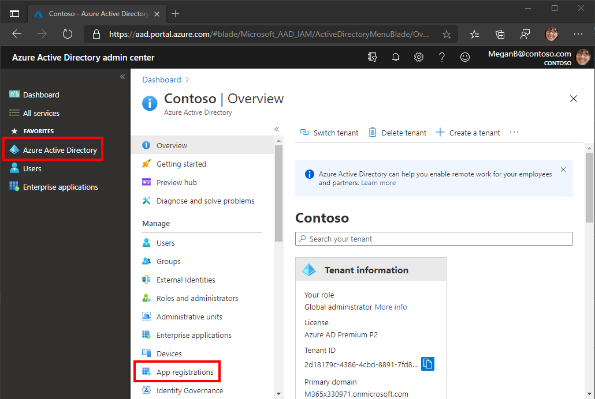

<!-- markdownlint-disable MD002 MD041 -->

В этом упражнении будет создаваться новая регистрация веб-приложений Azure AD с помощью центра администрирования Azure Active Directory.In this exercise, you will create a new Azure AD web application registration using the Azure Active Directory admin center.

1. Откройте браузер и перейдите в [Центр администрирования Azure Active Directory](https://aad.portal.azure.com).Open a browser and navigate to the [Azure Active Directory admin center](https://aad.portal.azure.com). Войдите с помощью **личной учетной записи** (т.е. учетной записи Microsoft) или **рабочей (учебной) учетной записи**.Login using a **personal account** (aka: Microsoft Account) or **Work or School Account**.

1. Выберите **Azure Active Directory** на панели навигации слева, затем выберите **Регистрация приложений** в разделе **Управление**.Select **Azure Active Directory** in the left-hand navigation, then select **App registrations** under **Manage**.

    

1. Выберите **Новая регистрация**.Select **New registration**. На странице **Зарегистрировать приложение** задайте необходимые значения следующим образом.On the **Register an application** page, set the values as follows.

    - Введите **имя** `Office Add-in Graph Tutorial`.Set **Name** to `Office Add-in Graph Tutorial`.
    - Введите **поддерживаемые типы учетных записей** для **учетных записей в любом каталоге организаций и личных учетных записей Microsoft**.Set **Supported account types** to **Accounts in any organizational directory and personal Microsoft accounts**.
    - В разделе **URI адрес перенаправления** введите значение в первом раскрывающемся списке `Single-page application (SPA)` и задайте значение `https://localhost:3000/consent.html`.Under **Redirect URI**, set the first drop-down to `Single-page application (SPA)` and set the value to `https://localhost:3000/consent.html`.

    

1. Нажмите **Зарегистрировать**.Select **Register**. На странице **Учебник по** надстройке Office скопируйте значение ID приложения **(клиента)** и сохраните его, оно потребуется на следующем шаге.On the **Office Add-in Graph Tutorial** page, copy the value of the **Application (client) ID** and save it, you will need it in the next step.

    

1. Выберите пункт **Проверка подлинности** в разделе **Управление**.Select **Authentication** under **Manage**. Найдите **раздел Неявный грант** и впускаем **маркеры Access** и **маркеры ID.**Locate the **Implicit grant** section and enable **Access tokens** and **ID tokens**. Нажмите **Сохранить**.Select **Save**.

    

1. Выберите **Сертификаты и секреты** в разделе **Управление**.Select **Certificates & secrets** under **Manage**. Нажмите кнопку **Новый секрет клиента**.Select the **New client secret** button. Введите значение в поле **Описание**, выберите один из параметров **Срок действия** и нажмите **Добавить**.Enter a value in **Description** and select one of the options for **Expires** and select **Add**.

1. Скопируйте значение секрета клиента, а затем покиньте эту страницу.Copy the client secret value before you leave this page. Оно вам понадобится на следующем шаге.You will need it in the next step.

    > [!IMPORTANT]
    > Это секрет клиента, он никогда не отображается еще раз, поэтому убедитесь, что вы скопировали его.This client secret is never shown again, so make sure you copy it now.

1. Выберите **разрешения API в** статье **Управление,** а затем **добавьте разрешение.**Select **API permissions** under **Manage**, then select **Add a permission**.

1. Выберите **Microsoft Graph,** затем **делегирование разрешений.**Select **Microsoft Graph**, then **Delegated permissions**.

1. Выберите следующие разрешения, а затем **добавьте разрешения.**Select the following permissions, then select **Add permissions**.

    - **offline_access** — это позволит приложению обновить маркеры доступа по истечении срока действия.**offline_access** - this will allow the app to refresh access tokens when they expire.
    - **Calendars.ReadWrite** — это позволит приложению читать и писать в календарь пользователя.**Calendars.ReadWrite** - this will allow the app to read and write to the user's calendar.
    - **MailboxSettings.Read** — это позволит приложению получать часовой пояс пользователя из параметров почтовых ящиков.**MailboxSettings.Read** - this will allow the app to get the user's time zone from their mailbox settings.

    

## Настройка единого входного знака Надстройки OfficeConfigure Office Add-in single sign-on

В этом разделе вы обновим регистрацию приложения для поддержки единого входного знака [Office Add-in (SSO).](https://docs.microsoft.com/office/dev/add-ins/develop/sso-in-office-add-ins)In this section you'll update the app registration to support [Office Add-in single sign-on (SSO)](https://docs.microsoft.com/office/dev/add-ins/develop/sso-in-office-add-ins).

1. Выберите **Expose aPI**.Select **Expose an API**. В **области, определенные этим разделом API,** выберите **Добавить область**.In the **Scopes defined by this API** section, select **Add a scope**. При запросе на набор **URI ID** приложения задай значение `api://localhost:3000/YOUR_APP_ID_HERE` , заменив его `YOUR_APP_ID_HERE` ИД приложения.When prompted to set an **Application ID URI**, set the value to `api://localhost:3000/YOUR_APP_ID_HERE`, replacing `YOUR_APP_ID_HERE` with the application ID. Выберите **Сохранить и продолжить**.Choose **Save and continue**.

1. Заполните поля следующим образом и выберите **область Добавить**.Fill in the fields as follows and select **Add scope**.

    - **Имя области:**`access_as_user`**Scope name:** `access_as_user`
    - **Кто может дать согласие?: Администраторы и пользователи****Who can consent?: Admins and users**
    - **Имя отображения согласия администратора:**`Access the app as the user`**Admin consent display name:** `Access the app as the user`
    - **Описание согласия администратора:**`Allows Office Add-ins to call the app's web APIs as the current user.`**Admin consent description:** `Allows Office Add-ins to call the app's web APIs as the current user.`
    - **Имя отображения согласия пользователя:**`Access the app as you`**User consent display name:** `Access the app as you`
    - **Описание согласия пользователя:**`Allows Office Add-ins to call the app's web APIs as you.`**User consent description:** `Allows Office Add-ins to call the app's web APIs as you.`
    - **Состояние: Включено****State: Enabled**

    

1. В разделе **Авторизованные клиентские приложения** выберите **Добавление клиентского приложения.**In the **Authorized client applications** section, select **Add a client application**. Введите клиентский ИД из следующего списка, введите область в уполномоченных сферах **и** выберите **приложение Добавить.**Enter a client ID from the following list, enable the scope under **Authorized scopes**, and select **Add application**. Повторите этот процесс для каждого из клиентских ИД в списке.Repeat this process for each of the client IDs in the list.

    - `d3590ed6-52b3-4102-aeff-aad2292ab01c` (Microsoft Office).`d3590ed6-52b3-4102-aeff-aad2292ab01c` (Microsoft Office)
    - `ea5a67f6-b6f3-4338-b240-c655ddc3cc8e` (Microsoft Office).`ea5a67f6-b6f3-4338-b240-c655ddc3cc8e` (Microsoft Office)
    - `57fb890c-0dab-4253-a5e0-7188c88b2bb4` (Office в Интернете).`57fb890c-0dab-4253-a5e0-7188c88b2bb4` (Office on the web)
    - `08e18876-6177-487e-b8b5-cf950c1e598c` (Office в Интернете).`08e18876-6177-487e-b8b5-cf950c1e598c` (Office on the web)
